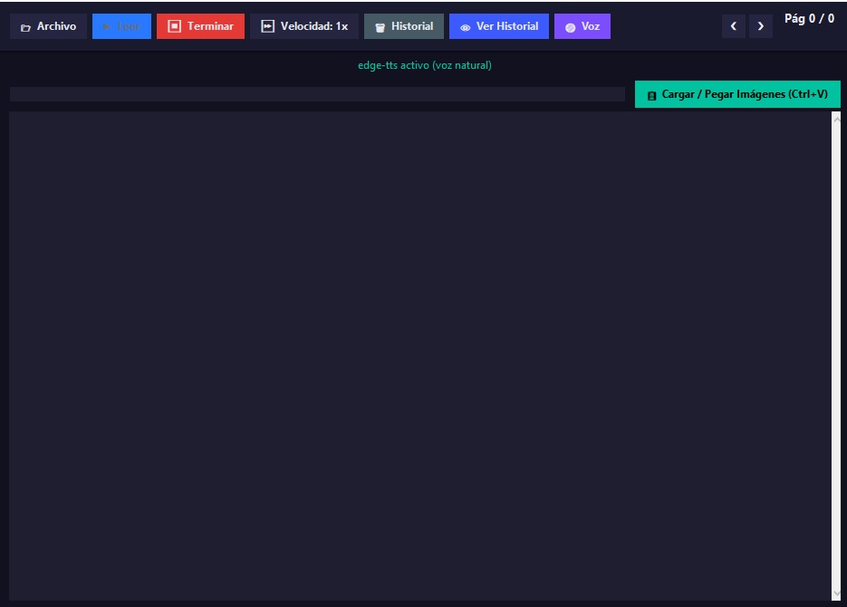
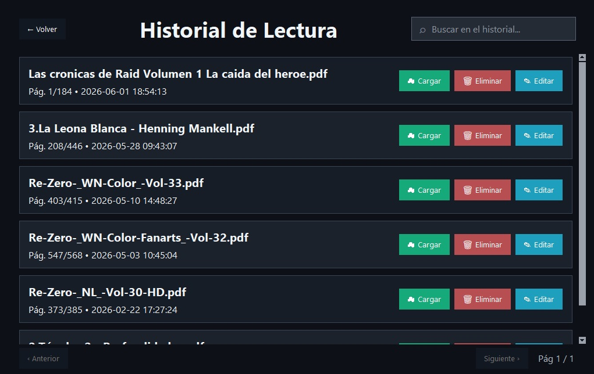
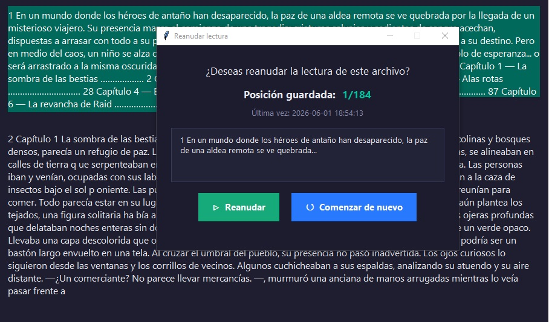
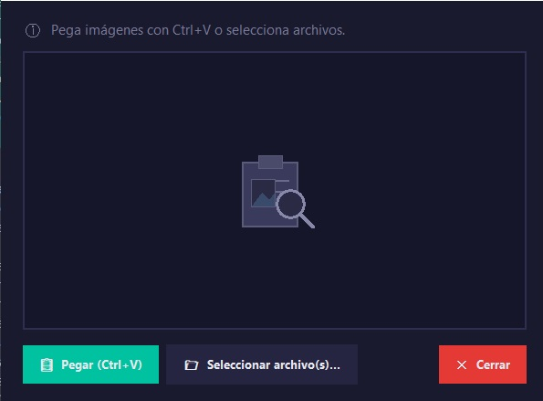

# Lector de PDFs

Aplicación de escritorio desarrollada en Python para leer documentos PDF mediante síntesis de voz.

## Funcionalidades

- Apertura de archivos PDF.
- OCR para imágenes y documentos escaneados.
- Lectura en voz alta.
- Historial automático.
- Marcador inteligente de progreso.
- Cambio de velocidad de lectura.
- Navegación por páginas.

## Tecnologías

- Python
- Tkinter
- PyTesseract
- Edge-TTS
- Pyttsx3

## Capturas

